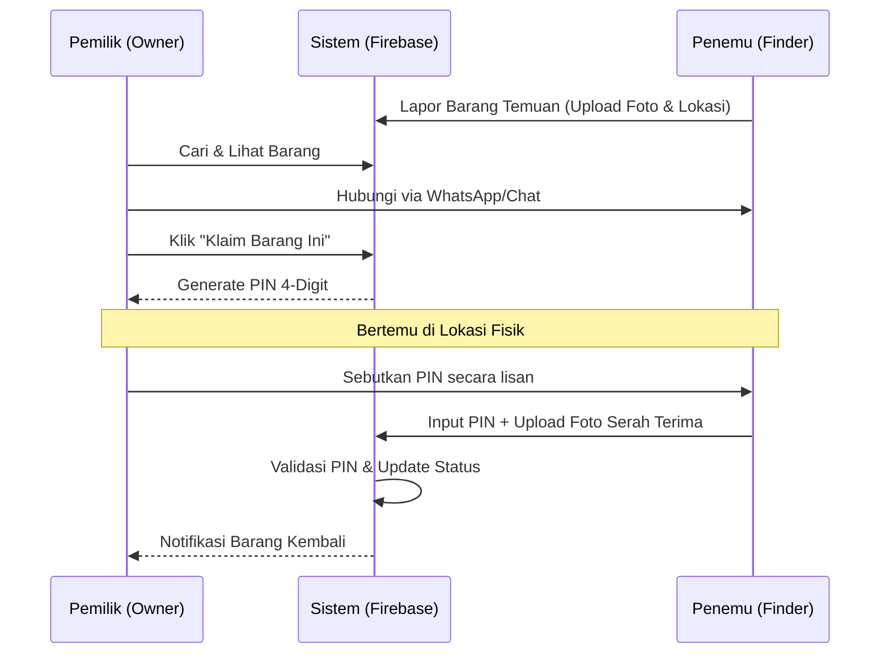

# Kampus Care 🛡️
**Solusi Terpercaya untuk Keamanan dan Pengembalian Barang di Lingkungan Kampus.**

Kampus Care adalah platform mobile berbasis Flutter yang dirancang untuk membantu mahasiswa, dosen, dan staf kampus dalam melaporkan serta mengelola barang yang hilang atau ditemukan. Dengan sistem verifikasi berbasis PIN dan bukti foto, Kampus Care memastikan setiap barang kembali ke pemilik sahnya dengan aman dan transparan.

---

## 📖 Daftar Isi
1. [Fitur Utama](#-fitur-utama)
2. [📱 Panduan Penggunaan](#-panduan-penggunaan)
3. [🔄 Alur Kerja Sistem](#-alur-kerja-sistem)
4. [🏗️ Arsitektur Proyek](#-arsitektur-proyek)
5. [🛠️ Spesifikasi Teknis](#-spesifikasi-teknis)
6. [📊 Model Data](#-model-data)
7. [🚀 Instalasi dan Konfigurasi](#-instalasi-dan-konfigurasi)
8. [🤝 Kontribusi](#-kontribusi)

---

## ✨ Fitur Utama

### 1. Manajemen Laporan (Lost & Found)
*   **Laporan Kehilangan**: Pengguna dapat memposting detail barang yang hilang, termasuk lokasi terakhir dilihat dan foto referensi.
*   **Laporan Temuan**: Penemu barang dapat mengunggah detail barang yang ditemukan untuk dicocokkan oleh pemiliknya.
*   **Kategori Barang**: Pengelompokan berdasarkan Elektronik, Dokumen, Kunci, Dompet, dan lainnya.

### 2. Pencarian & Filter Canggih
*   Pencarian berbasis kata kunci secara real-time.
*   Filter berdasarkan status (Hilang/Ditemukan), kategori, dan rentang waktu pelaporan.

### 3. Integrasi Peta (Location Tagging)
*   Menggunakan peta interaktif berbasis OpenStreetMap (FlutterMap) untuk menentukan titik lokasi penemuan atau kehilangan secara presisi menggunakan koordinat GPS.

### 4. Sistem Handover Aman (Fitur Unggulan)
*   **Klaim Barang**: Pemilik barang dapat melakukan klaim pada barang yang ditemukan.
*   **Verifikasi PIN**: Sistem men-generate 4-digit PIN unik untuk pemilik yang harus diberikan kepada penemu saat serah terima.
*   **Bukti Foto**: Penemu wajib mengunggah foto bukti serah terima sebagai syarat penyelesaian laporan.

### 5. Notifikasi Real-time
*   Pemberitahuan instan saat ada barang baru yang sesuai dengan kriteria, saat barang diklaim, atau saat validasi berhasil dilakukan.

---

## 📱 Panduan Penggunaan

### 🔐 Langkah 1: Instalasi dan Login
1. **Download & Pasang Aplikasi**
   - Unduh aplikasi Kampus Care dari platform distribusi aplikasi Anda.
   - Buka aplikasi setelah instalasi selesai.

2. **Buat Akun atau Login**
   - Jika pengguna baru: Klik **Daftar** dan isi email dengan format `@student.campus.ac.id` atau `@staff.campus.ac.id`.
   - Masukkan password yang kuat (minimal 8 karakter).
   - Verifikasi email Anda melalui tautan yang dikirim ke inbox.
   - Jika sudah memiliki akun: Klik **Login** dan masukkan email serta password Anda.

---

### 📝 Langkah 2: Melaporkan Barang Hilang

1. **Akses Menu Laporan**
   - Tekan tombol **"+ Buat Laporan"** atau ikon **"Tambah"** di menu utama.

2. **Pilih Jenis Laporan**
   - Klik **"Laporan Kehilangan"**.

3. **Isi Detail Barang**
   - **Nama Barang**: Contoh "Laptop Dell XPS 15".
   - **Deskripsi**: Jelaskan ciri-ciri barang secara detail (warna, merek, kondisi).
   - **Kategori**: Pilih dari daftar (Elektronik, Dokumen, Dompet, Kunci, Tas, Pakaian, dll).

4. **Tentukan Lokasi Kehilangan**
   - Tekan tombol **"Pilih Lokasi di Peta"**.
   - Pindahkan pin merah ke lokasi terakhir Anda melihat barang tersebut.
   - Tekan **"Konfirmasi Lokasi"**.

5. **Unggah Foto Barang**
   - Klik **"Ambil Foto"** untuk menggunakan kamera atau **"Pilih dari Galeri"**.
   - Pastikan foto jelas menunjukkan barang dari berbagai sudut.

6. **Selesaikan Laporan**
   - Periksa kembali semua informasi.
   - Tekan **"Kirim Laporan Kehilangan"**.
   - Laporan Anda sekarang akan muncul di feed aplikasi dan dilihat oleh semua pengguna.

---

### 🔍 Langkah 3: Melaporkan Barang Ditemukan

1. **Akses Menu Laporan**
   - Tekan tombol **"+ Buat Laporan"** atau ikon **"Tambah"** di menu utama.

2. **Pilih Jenis Laporan**
   - Klik **"Laporan Temuan"**.

3. **Isi Detail Barang yang Ditemukan**
   - **Nama Barang**: Apa yang Anda temukan (Contoh: "Dompet Hitam Kulit").
   - **Deskripsi**: Ciri-ciri barang dan kondisinya.
   - **Kategori**: Pilih kategori yang sesuai.

4. **Tentukan Lokasi Penemuan**
   - Tekan **"Pilih Lokasi di Peta"**.
   - Tandai lokasi tepatnya di mana Anda menemukan barang.
   - Hal ini penting agar pemilik bisa mengidentifikasi lokasi penemuan.

5. **Unggah Foto Barang**
   - Ambil foto barang dari kondisi aslinya.
   - Jika memungkinkan, ambil foto dari beberapa sudut yang jelas.

6. **Pilih Tempat Penyimpanan**
   - Pilih tempat penyimpanan barang (pilihan: "Dengan Saya", "Di Tempat Ditemukan", "Sudah Diserahkan ke Satpam", dll).

7. **Selesaikan Laporan**
   - Tekan **"Kirim Laporan Temuan"**.
   - Barang Anda akan diunggah ke sistem dan bisa dilihat oleh pemilik yang mencari.

---

### 🔎 Langkah 4: Mencari Barang

1. **Buka Halaman Pencarian**
   - Di menu utama, tekan tab **"Cari Barang"** atau ikon pencarian.

2. **Gunakan Pencarian Cepat**
   - Ketik nama barang yang Anda cari di kolom pencarian.
   - Hasil pencarian akan muncul secara real-time.

3. **Filter Hasil Pencarian**
   - **Berdasarkan Kategori**: Pilih kategori spesifik untuk mempersempit hasil.
   - **Berdasarkan Status**: 
     - "Hilang" = Barang yang ditemukan hilang atau dilaporkan hilang di lingkungan kampus.
     - "Ditemukan" = Barang yang telah dilakukan validasi dan dikembalikan kepada pemilik barang.
   - **Berdasarkan Jarak**: Tampilkan barang dalam radius tertentu dari lokasi Anda.

4. **Lihat Detail Barang**
   - Klik salah satu kartu barang untuk melihat informasi lengkap.
   - Lihat foto, deskripsi, lokasi di peta, dan data pelapor.

5. **Hubungi Penemu atau Pemilik**
   - Jika Anda ingin mengetahui informasi lebih lanjut, tekan tombol **"Hubungi via WhatsApp"**.
   - Aplikasi akan membuka WhatsApp dengan template pesan otomatis.

---

### ✅ Langkah 5: Mengklaim Barang yang Ditemukan

**Jika Anda adalah PEMILIK dan menemukan barang Anda di sistem:**

1. **Buka Detail Barang**
   - Cari dan klik barang yang Anda yakini sebagai milik Anda.

2. **Periksa Detail**
   - Verifikasi apakah foto, deskripsi, dan lokasi cocok dengan barang Anda.
   - Bandingkan dengan ciri-ciri unik (merek, warna, tanda khusus, dll).

3. **Klaim Barang**
   - Tekan tombol **"Klaim Barang Ini"**.
   - Sistem akan menampilkan **PIN 4-digit unik** untuk Anda.
   - **PENTING**: Catat PIN ini dan jangan bagikan via chat atau WhatsApp.

4. **Hubungi Penemu**
   - Tekan **"Hubungi Penemu via WhatsApp"**.
   - Sepakati waktu dan lokasi pertemuan yang aman (contoh: di pos satpam, perpustakaan, atau pintu masuk utama).
   - Jangan berikan PIN di WhatsApp, sebutkan PIN hanya saat bertemu secara langsung.

5. **Menunggu Balasan**
   - Penemu akan merespons untuk menyepakati pertemuan.
   - Status klaim Anda akan berubah menjadi "Menunggu Konfirmasi".

---

### 🤝 Langkah 6: Menyelesaikan Serah Terima Barang

**Jika Anda adalah PENEMU dan barang temuan Anda telah diklaim oleh pemilik:**

1. **Lihat Klaim di Tab "Validasi"**
   - Di menu utama, buka tab **"Validasi"**.
   - Anda akan melihat barang milik Anda yang sedang diklaim beserta nama pemilik.

2. **Persiapan Pertemuan Fisik**
   - Pemilik akan menghubungi Anda via WhatsApp untuk menyepakati waktu dan lokasi.
   - Pastikan Anda siap menemui pemilik di lokasi yang disepakati.
   - Bawa barang yang ditemukan tersebut dalam kondisi terbaik.

3. **Saat Pertemuan Langsung**
   - Pemilik akan menyebutkan 4-digit PIN miliknya secara lisan kepada Anda.
   - Verifikasi bahwa barang yang Anda bawa sesuai dengan yang diklaim.

4. **Konfirmasi di Aplikasi**
   - Buka tab **"Validasi"** dan klik barang yang sedang diserahkan.
   - Tekan tombol **"Konfirmasi Selesai"**.

5. **Masukkan PIN**
   - Masukkan 4-digit PIN yang diberikan oleh pemilik.
   - Jika PIN benar, lanjutkan ke langkah berikutnya.
   - Jika PIN salah atau sudah kedaluwarsa (24 jam), minta pemilik untuk membuat klaim baru di aplikasi.

6. **Unggah Foto Bukti Serah Terima**
   - Tekan **"Ambil Foto"** atau **"Pilih dari Galeri"**.
   - Ambil foto yang menunjukkan barang sedang diserahkan atau sudah diterima pemilik.
   - Hal ini berfungsi sebagai bukti transparansi dan keamanan transaksi.

7. **Selesaikan Proses**
   - Tekan **"Konfirmasi Serah Terima"**.
   - Sistem akan memvalidasi PIN dan menyimpan foto bukti.
   - Status barang akan berubah menjadi **"Dikembalikan"**.
   - Pemilik akan menerima notifikasi bahwa barangnya sudah berhasil dikembalikan.

---

### 📍 Panduan Tambahan

#### Melihat Riwayat Barang Anda
*   Buka menu **"Profil"** -> **"Riwayat Laporan"**.
*   Lihat semua barang yang pernah Anda laporkan (hilang/ditemukan) beserta statusnya.

#### Mengelola Notifikasi
*   Buka **"Pengaturan"** -> **"Notifikasi"**.
*   Aktifkan pemberitahuan untuk barang di kategori pilihan atau area lokasi tertentu.
*   Notifikasi akan dikirim saat ada barang baru yang dilaporkan sesuai kriteria Anda.

#### Menghubungi Layanan Bantuan
*   Jika terjadi kendala, buka **"Bantuan"** -> **"Hubungi Kami"**.
*   Sampaikan keluhan Anda secara jelas untuk mendapat bantuan dari tim admin.

---

## 🔄 Alur Kerja Sistem

### Alur Pelaporan dan Serah Terima


### 🛠️ Penjelasan Cara Kerja Keamanan Sistem

Sistem keamanan Kampus Care dirancang untuk meminimalkan risiko penipuan atau salah serah terima barang melalui alur terstruktur berikut:

#### 1. Pembuatan Laporan
*   **Laporan Kehilangan**: Pengguna membuat laporan dengan mencantumkan informasi barang, deskripsi, kategori, serta menandai lokasi kehilangan di peta interaktif.
*   **Laporan Temuan**: Penemu barang mengunggah foto asli barang dan menentukan koordinat GPS titik penemuan.

#### 2. Pencarian dan Pencocokan
*   Pengguna dapat mencari barang dengan kata kunci secara real-time.
*   Peta interaktif mempermudah visualisasi sebaran lokasi penemuan barang.

#### 3. Klaim Barang & Pembuatan PIN
*   Jika pemilik mengenali barangnya di daftar temuan, ia dapat menekan **"Klaim Barang Ini"**.
*   Sistem menghasilkan **4-digit PIN unik** yang disimpan di Cloud Firestore dengan masa berlaku **24 jam**.
*   PIN ini bersifat rahasia dan hanya terlihat pada layar pengklaim.
*   > [!IMPORTANT]
    > Pemilik sangat dilarang membagikan PIN melalui obrolan teks (WhatsApp/Chat). PIN ini hanya boleh dibacakan langsung saat serah terima fisik dilakukan.

#### 4. Pertemuan Fisik
*   Pengguna dapat menekan ikon WhatsApp untuk membuka komunikasi langsung dengan penemu barang guna menyepakati lokasi pertemuan yang aman.

#### 5. Verifikasi PIN dan Bukti Foto
*   Penemu memasukkan PIN yang disebutkan pemilik ke tab **"Validasi"** di aplikasinya.
*   Penemu wajib mengambil foto bukti serah terima secara langsung.
*   Jika PIN benar dan valid, status barang diubah menjadi `dikembalikan`, foto disimpan ke Firebase Storage, dan klaim ditandai selesai.

---

## 🏗️ Arsitektur Proyek

Proyek ini menggunakan pola **Layered Architecture** untuk memisahkan logika bisnis dari antarmuka pengguna:

```bash
lib/
├── app/                  # Inisialisasi aplikasi (App entry & Root Provider)
├── core/                 # Komponen inti
│   ├── constants/        # Warna, String, dan Gaya Global
│   ├── theme/            # Tema Material Design 3
│   └── utils/            # Helper (Formatter Tanggal, Validasi, dll)
├── data/                 # Layer Data
│   ├── models/           # Definisi Objek Data (Item, User, Notification)
│   ├── repositories/     # Abstraksi pengambilan data dari Firestore
│   └── services/         # Layanan eksternal (Camera, Firebase, Maps)
├── presentation/         # Layer UI
│   ├── providers/        # State Management (Logika Bisnis & Reaktivitas)
│   ├── screens/          # Halaman Utama (Home, Auth, Report, Validation)
│   └── widgets/          # Komponen UI yang dapat digunakan kembali (ItemCard, CustomButtons)
└── main.dart             # Konfigurasi awal Firebase & Bootstrapping
```

---

## 🛠️ Spesifikasi Teknis

*   **Bahasa Pemrograman**: Dart
*   **Framework UI**: Flutter (v3.0.0+)
*   **State Management**: Provider
*   **Backend & Database**:
    *   **Cloud Firestore**: Database NoSQL untuk data barang dan status klaim.
    *   **Firebase Authentication**: Autentikasi berbasis Email/Password.
    *   **Firebase Storage**: Penyimpanan berkas foto barang dan bukti serah terima.
*   **Pustaka Pendukung**:
    *   `flutter_map`: Untuk visualisasi peta OpenStreetMap.
    *   `image_picker`: Pengambilan gambar via kamera atau galeri.
    *   `url_launcher`: Integrasi WhatsApp dan link eksternal.

---

## 📊 Model Data

### Objek Barang (ItemModel)
| Field | Tipe | Deskripsi |
|---|---|---|
| `id` | String | ID Unik Dokumen Firestore |
| `title` | String | Nama Barang |
| `status` | String | Status (`hilang` untuk barang yang ditemukan/dilaporkan hilang, atau `ditemukan` untuk barang yang telah divalidasi dan dikembalikan kepada pemilik barang) |
| `category` | String | Kategori (Elektronik, Kunci, dll) |
| `reportedBy` | String | UID pelapor (Finder/Owner) |
| `locationName`| String | Deskripsi lokasi manual |
| `latitude/longitude`| Double | Koordinat GPS presisi |
| `claimedBy` | String? | UID pengguna yang melakukan klaim |
| `returnedAt` | DateTime? | Waktu keberhasilan validasi serah terima |

---

## 🚀 Instalasi dan Konfigurasi

### 1. Persiapan Lingkungan
Pastikan Flutter SDK telah terinstal di komputer Anda:
```bash
flutter doctor
```

### 2. Kloning Repositori
```bash
git clone https://github.com/username-anda/kampus_care.git
cd kampus_care
```

### 3. Konfigurasi Firebase
1. Buat proyek baru di [Firebase Console](https://console.firebase.google.com/).
2. Aktifkan layanan **Authentication**, **Cloud Firestore**, dan **Cloud Storage**.
3. Daftarkan aplikasi Android dan iOS Anda.
4. Letakkan file konfigurasi `google-services.json` pada folder `android/app/` dan `GoogleService-Info.plist` pada folder `ios/Runner/`.

### 4. Menjalankan Aplikasi
```bash
flutter pub get
flutter run
```

---

### Dikembangkan oleh Tim Kampus Care.
"Kembalikan kejujuran ke setiap sudut kampus."
